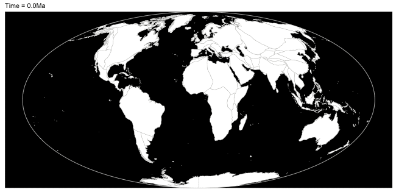
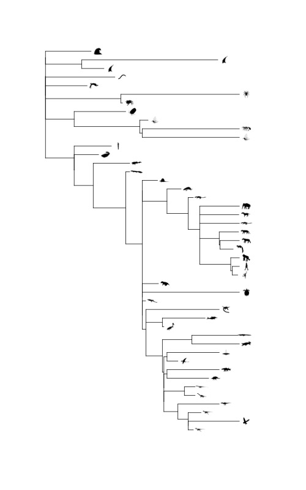

---
output:
  knitrBootstrap::bootstrap_document:
    title: "History of Earth"
    theme: cyborg
    highlight: sunburst
    theme.chooser: TRUE
    highlight.chooser: TRUE
runtime: shiny_prerendered
---

```{r setup, include=FALSE}
knitr::opts_chunk$set(echo = TRUE)
```

```{r echo=FALSE}
shiny::includeScript(path = "main.js")
```


```{r echo=FALSE}
knitr::asis_output(htmltools::htmlPreserve('
  <div class="container-fluid">
 <div class="row overview_vg">
      <div class="col-sm-12" style="background-color:#545353" align="center">
        <button id="overview_vg" type="button" class="btn btn-default action-button" align="center" onclick="window.open(&#39;https://quizlet.com/365498277/test&#39;, &#39;_blank&#39;)" style="padding: 1px; color: #ffffff; background-color:#545353; border-color:#545353">Questions</button>
      </div>
    </div>
    <div class="row Eras">
      <div class="col-sm-6" style="background-color:#FFFF99" align="center">
        <button id="paleozoic_button" type="button" class="btn btn-default action-button" onclick="window.open(&#39;https://youtu.be/RDQa0okkpf0&#39;, &#39;_blank&#39;)" style="padding: 1px; color: #000000; background-color:#FFFF99; border-color:#FFFF99">Paleozoic Era</button>
      </div>
      <div class="col-sm-3" style="background-color:#1F78B4" align="center">
        <button id="mesozoic_button" type="button" class="btn btn-default action-button" onclick="window.open(&#39;https://youtu.be/ZoHO3fAj_78&#39;, &#39;_blank&#39;)" style="padding: 1px; background-color:#1F78B4; border-color:#1F78B4">Mesozoic Era</button>
      </div>
      <div class="col-sm-3" style="background-color:#B2DF8A" align="center">
        <button id="cenozoic_button" type="button" class="btn btn-default action-button" onclick="window.open(&#39;https://youtu.be/2ofNufZVcMU&#39;, &#39;_blank&#39;)" style="padding: 1px; color: #000000; background-color:#B2DF8A; border-color:#B2DF8A">Cenozoic Era</button>
      </div>
    </div>
    <div class="row Veiwer_Guides">
      <div class="col-sm-6" style="background-color:#FFFF99" align="center">
        <button id="paleozoic_vg" type="button" class="btn btn-default action-button" onclick="window.open(&#39;https://quizlet.com/365224880/test&#39;, &#39;_blank&#39;)" style="padding: 1px; color: #000000; background-color:#FFFF99; border-color:#FFFF99">Questions</button>
      </div>
      <div class="col-sm-3" style="background-color:#1F78B4" align="center">
        <button id="mesozoic_vg" type="button" class="btn btn-default action-button" onclick="window.open(&#39;https://quizlet.com/365535631/test&#39;, &#39;_blank&#39;)" style="padding: 1px; background-color:#1F78B4; border-color:#1F78B4">Questions</button>
      </div>
      <div class="col-sm-3" style="background-color:#B2DF8A" align="center">
        <button id="cenozoic_vg" type="button" class="btn btn-default action-button" onclick="window.open(&#39;https://quizlet.com/365527235/test&#39;, &#39;_blank&#39;)" style="padding: 1px; color: #000000; background-color:#B2DF8A; border-color:#B2DF8A">Questions</button>
      </div>
    </div>
    <div class="row Periods">
      <div class="col-sm-1" style="background-color:#A6CEE3" align="center">
        <button id="cambrian_button" type="button" class="btn btn-default action-button" onclick="window.open(&#39;https://www.nationalgeographic.com/science/prehistoric-world/cambrian/&#39;, &#39;_blank&#39;)" style="padding: 6px 0px; color: #000000; background-color:#A6CEE3; border-color:#A6CEE3">Cambrian</button>
      </div>
      <div class="col-sm-1" style="background-color:#1F78B4" align="center">
        <button id="ordovician_button" type="button" class="btn btn-default action-button" onclick="window.open(&#39;https://youtu.be/yQhlUqLFDxQ&#39;, &#39;_blank&#39;)" style="padding: 6px 0px; background-color:#1F78B4; border-color:#1F78B4">Ordovician</button>
      </div>
      <div class="col-sm-1" style="background-color:#B2DF8A" align="center">
        <button id="silurian_button" type="button" class="btn btn-default action-button" onclick="window.open(&#39;http://www.ucmp.berkeley.edu/silurian/silurian.php&#39;, &#39;_blank&#39;)" style="padding: 6px 0px; color: #000000; background-color:#B2DF8A; border-color:#B2DF8A">Silurian</button>
      </div>
      <div class="col-sm-1" style="background-color:#33A02C" align="center">
        <button id="devonian_button" type="button" class="btn btn-default action-button" onclick="window.open(&#39;https://youtu.be/6Fr8vL9-j2Q&#39;, &#39;_blank&#39;)" style="padding: 6px 0px; background-color:#33A02C; border-color:#33A02C">Devonian</button>
      </div>
      <div class="col-sm-1" style="background-color:#FB9A99" align="center">
        <button id="carboniferous_button" type="button" class="btn btn-default action-button" onclick="window.open(&#39;http://www.ucmp.berkeley.edu/carboniferous/carboniferous.php&#39;, &#39;_blank&#39;)" style="padding: 6px 0px; color: #000000; background-color:#FB9A99; border-color:#FB9A99">Carboniferous</button>
      </div>
      <div class="col-sm-1" style="background-color:#E31A1C" align="center">
        <button id="permian_button" type="button" class="btn btn-default action-button" onclick="window.open(&#39;https://youtu.be/FlEC6tp36nw&#39;, &#39;_blank&#39;)" style="padding: 6px 0px; background-color:#E31A1C; border-color:#E31A1C">Permian</button>
      </div>
      <div class="col-sm-1" style="background-color:#FDBF6F" align="center">
        <button id="triassic_button" type="button" class="btn btn-default action-button" onclick="window.open(&#39;https://youtu.be/moxu_uTemNg&#39;, &#39;_blank&#39;)" style="padding: 6px 0px; color: #000000; background-color:#FDBF6F; border-color:#FDBF6F">Triassic</button>
      </div>
      <div class="col-sm-1" style="background-color:#FF7F00" align="center">
        <button id="jurassic_button" type="button" class="btn btn-default action-button" onclick="window.open(&#39;https://youtu.be/OYUwrA-jZok&#39;, &#39;_blank&#39;)" style="padding: 6px 0px; background-color:#FF7F00; border-color:#FF7F00">Jurassic</button>
      </div>
      <div class="col-sm-1" style="background-color:#CAB2D6" align="center">
        <button id="cretaceous_button" type="button" class="btn btn-default action-button" onclick="window.open(&#39;https://www.nationalgeographic.com/science/prehistoric-world/cretaceous/&#39;, &#39;_blank&#39;)" style="padding: 6px 0px; color: #000000; background-color:#CAB2D6; border-color:#CAB2D6">Cretaceous</button>
      </div>
      <div class="col-sm-1" style="background-color:#6A3D9A" align="center">
        <button id="paleogene_button" type="button" class="btn btn-default action-button" onclick="window.open(&#39;https://www.nationalgeographic.com/science/prehistoric-world/paleogene/&#39;, &#39;_blank&#39;)" style="padding: 6px 1px; background-color:#6A3D9A; border-color:#6A3D9A">Paleogene</button>
      </div>
      <div class="col-sm-1" style="background-color:#FFFF99" align="center">
        <button id="neogene_button" type="button" class="btn btn-default action-button" onclick="window.open(&#39;https://www.nationalgeographic.com/science/prehistoric-world/neogene/&#39;, &#39;_blank&#39;)" style="padding: 6px 0px; color: #000000; background-color:#FFFF99; border-color:#FFFF99">Neogene</button>
      </div>
      <div class="col-sm-1" style="background-color:#B15928" align="center">
        <button id="quaternary_button" type="button" class="btn btn-default action-button" onclick="window.open(&#39;https://www.nationalgeographic.com/science/prehistoric-world/quaternary/&#39;, &#39;_blank&#39;)" style="padding: 6px 0px; background-color:#B15928; border-color:#B15928">Quaternary</button>
      </div>
</div>
'))
```

```{r selecttaxon, echo=FALSE}
genus_choices <- c("https://upload.wikimedia.org/wikipedia/commons/c/c1/La_Brea_Tar_Pits.jpg", unname(sapply(HistoryOfEarth::GetTaxa(), HistoryOfEarth::GetWikipediaThumbnail)))
names(genus_choices) <- c("all", HistoryOfEarth::GetTaxa())
shiny::selectInput("genus", "Choose an organism:",
    choices = genus_choices,
    multiple = FALSE, selected=unname(genus_choices[1]), selectize=FALSE)

shiny::selectInput("period", "Choose a period:",
                choices = c("all", HistoryOfEarth::GetAgeDF()$Period),
                multiple = FALSE, selected="all", selectize=FALSE)
```

```{r echo=FALSE}
knitr::asis_output(htmltools::htmlPreserve('
<script type="text/javascript">

var g = document.getElementById("genus");
g.addEventListener("change", function() {
    var selected = $(this).find("option:selected");
    //alert(selected.val() + " " + selected.text());
    document.getElementById("organismphoto").src=selected.val();
    document.getElementById("map").src="img/map_" + selected.text() + "_all.gif";

var p = document.getElementById("period");
p.addEventListener("change", function() {
        var selected = $(this).find("option:selected");
        //alert(selected.val() + " " + selected.text());
        document.getElementById("map").src="img/map_all" + selected.text() + ".gif";

});
</script>
'))
```


```{r echo=FALSE}
knitr::asis_output(htmltools::htmlPreserve('

<script>

//var a = document.getElementById("genus");
//a.addEventListener("change", function() {
//  alert(this.text);
//}, false);
</script>







'))
```
